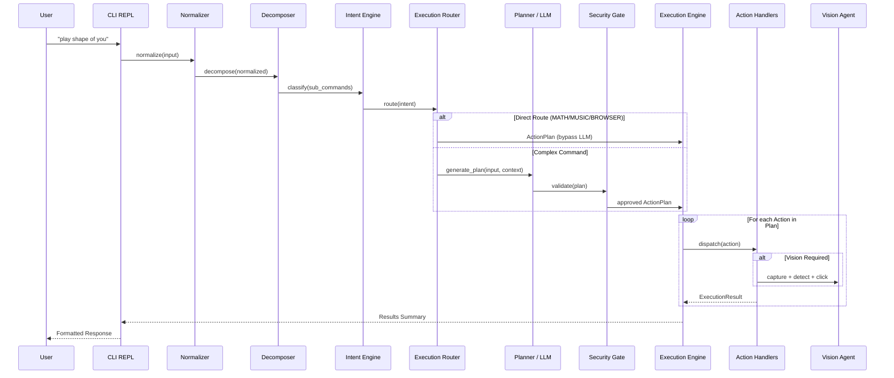

# Aegis — System Architecture

## High-Level Architecture

```mermaid
graph TB
    subgraph USER["🧑 User Interface Layer"]
        CLI["cli.py — REPL Loop"]
        CP["command_processor.py"]
        REND["cli_renderer.py"]
        REPL["repl_controller.py"]
        STAT["status_panel.py"]
    end

    subgraph BRAIN["🧠 Brain Layer — Intelligence"]
        CN["command_normalizer.py"]
        CD["command_decomposer.py"]
        IE["intent_engine.py"]
        ER["execution_router.py"]
        PL["planner.py"]
        CP2["contextual_planner.py"]
        PV["plan_validator.py"]
        ME["math_engine.py"]
        CE["conversation_engine.py"]
        MD["mood_detector.py"]
        TC["tone_controller.py"]
        GE["greeting_engine.py"]
        PE["proactive_engine.py"]
        KE["knowledge_engine.py"]
        AN["action_normalizer.py"]
        NR["normalizer_rules.py"]
        LLM["llm/ — LLM Provider"]
    end

    subgraph EXEC["⚡ Execution Layer"]
        ENG["engine.py — Execution Engine"]
        VR["variable_resolver.py"]
        VE["verification_engine.py"]
        CR["conflict_resolver.py"]
        subgraph ACTIONS["Action Handlers"]
            AA["app_actions.py"]
            UA["ui_actions.py"]
            BA["browser_actions.py"]
            FA["file_actions.py"]
            MA["math_actions.py"]
            PA["powershell_actions.py"]
            RA["research_actions.py"]
            RH["research_handlers.py"]
            SA["system_actions.py"]
            OA["org_actions.py"]
            RT["respond_text.py"]
            MDA["media_actions.py"]
        end
        subgraph UI_AUTO["UI Automation"]
            WF["window_focus.py"]
            CORE_UI["core.py"]
        end
    end

    subgraph AGENTS["🤖 Agents"]
        BRAG["browser_agent.py"]
        subgraph VISION["Vision Agent (v6.2)"]
            SC["screen_capture.py"]
            OD["object_detector.py"]
            TD["text_detector.py"]
            UII["ui_interactor.py"]
            VC["vision_controller.py"]
        end
    end

    subgraph BROWSER["🌐 Browser Automation"]
        BC["browser_controller.py"]
        BR["browser_router.py"]
    end

    subgraph CORE["⚙️ Core Services"]
        AR["app_registry.py"]
        ARJ["app_registry.json"]
        ARS["app_registry_scanner.py"]
        PM["process_manager.py"]
        SS["system_state.py"]
        ST["state.py — Working Memory"]
        TM["task_manager.py"]
        WT["window_tracker.py"]
        ES["environment_scanner.py"]
        SI["system_inspector.py"]
        DC["dependency_checker.py"]
        SLP["sleep_service.py"]
    end

    subgraph MEMORY["💾 Memory Layer"]
        MM["memory_manager.py"]
        SM["session_memory.py"]
        WM["working_memory.py"]
        UM["user_memory.py"]
        KS["knowledge_store.py"]
        PS["preference_store.py"]
        VS["vector_store.py"]
        DB[("aegis_memory.db")]
    end

    subgraph SECURITY["🔒 Security Layer"]
        VAL["validator.py"]
        AG["approval_gate.py"]
        RSK["risk_assessor.py"]
        WL["whitelist.py"]
    end

    subgraph CONFIG["📋 Config"]
        CFG["config.py"]
        CFGD["config/ dir"]
    end

    %% === Data Flow ===
    CLI --> CP
    CP --> CN
    CN --> CD
    CD --> IE
    IE --> ER
    ER --> ME
    ER --> PL
    ER --> BRAG
    PL --> CP2
    PL --> LLM
    CP2 --> LLM
    PL --> PV
    PV --> VAL
    VAL --> AG
    AG --> ENG
    ER --> ENG
    ENG --> VR
    ENG --> ACTIONS
    ENG --> VE
    ENG --> CR
    AA --> AR
    AA --> PM
    UA --> UI_AUTO
    UA --> CORE_UI
    BA --> BROWSER
    VC --> SC
    VC --> OD
    VC --> TD
    VC --> UII
    ENG --> VC
    MM --> DB
    SM --> ST
    WM --> ST
    ENG --> ST
    MD --> CE

    style USER fill:#1a1a2e,stroke:#e94560,color:#fff
    style BRAIN fill:#16213e,stroke:#0f3460,color:#fff
    style EXEC fill:#0f3460,stroke:#533483,color:#fff
    style AGENTS fill:#533483,stroke:#e94560,color:#fff
    style CORE fill:#1a1a2e,stroke:#0f3460,color:#fff
    style MEMORY fill:#16213e,stroke:#533483,color:#fff
    style SECURITY fill:#e94560,stroke:#fff,color:#fff
    style BROWSER fill:#0f3460,stroke:#e94560,color:#fff
    style CONFIG fill:#1a1a2e,stroke:#533483,color:#fff
```

## Command Pipeline Flow

## Module Inventory

| Layer | Module | Purpose |
|-------|--------|---------|
| **Interface** | `cli.py` | REPL loop, header, mood display |
| | `command_processor.py` | Built-in commands + AI pipeline dispatch |
| | `cli_renderer.py` | Formatted terminal output |
| **Brain** | `command_normalizer.py` | Lowercase, synonym, fuzzy typo correction |
| | `command_decomposer.py` | Splits compound commands ("and", "then") |
| | `intent_engine.py` | Classifies: MATH, BROWSER, MUSIC, SYSTEM, etc. |
| | `execution_router.py` | Fast-path routing bypassing LLM |
| | `planner.py` | LLM-based ActionPlan generation |
| | `math_engine.py` | Safe arithmetic evaluation |
| | `mood_detector.py` | Sentiment analysis + MoodState |
| **Execution** | `engine.py` | Retry, fallback, variable resolution, dispatch |
| | `variable_resolver.py` | Replaces `{result}` placeholders |
| | `verification_engine.py` | Post-action verification |
| | `app_actions.py` | Open/focus applications via registry |
| | `ui_actions.py` | Type text, click, hotkey, scroll |
| | `media_actions.py` | Play music via browser |
| **Agents** | `browser_agent.py` | Selenium-based web automation |
| | `vision_controller.py` | Screen capture → detect → click |
| | `object_detector.py` | YOLOv8 UI element detection |
| | `text_detector.py` | Pytesseract OCR |
| **Core** | `app_registry.py` | Logical name → executable mapping |
| | `process_manager.py` | psutil process scanning |
| | `state.py` | Working memory, session memory singletons |
| **Memory** | `memory_manager.py` | SQLite persistent memory |
| | `session_memory.py` | Per-session volatile state |
| | `user_memory.py` | User preferences and facts |
| **Security** | `validator.py` | Command validation |
| | `approval_gate.py` | Risk-based approval for dangerous actions |
| | `whitelist.py` | Allowed commands/apps |
